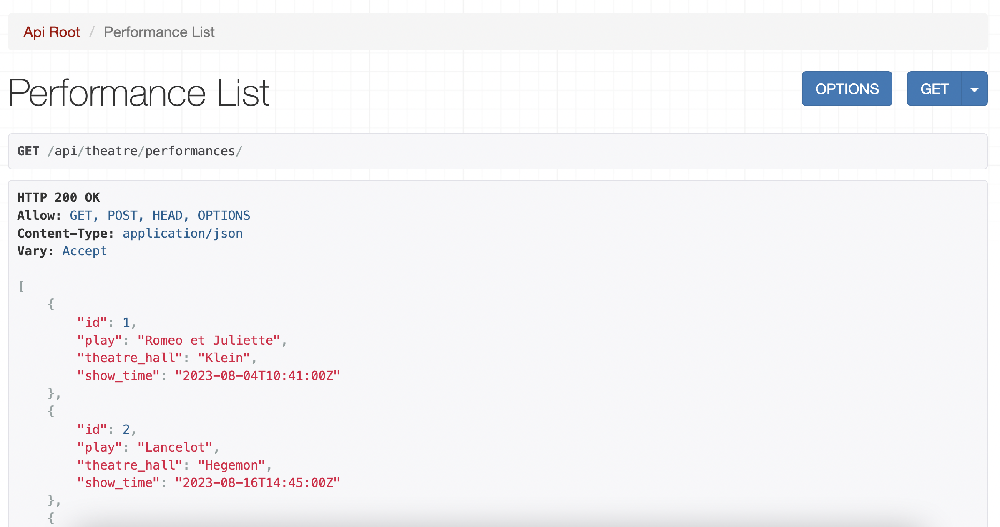
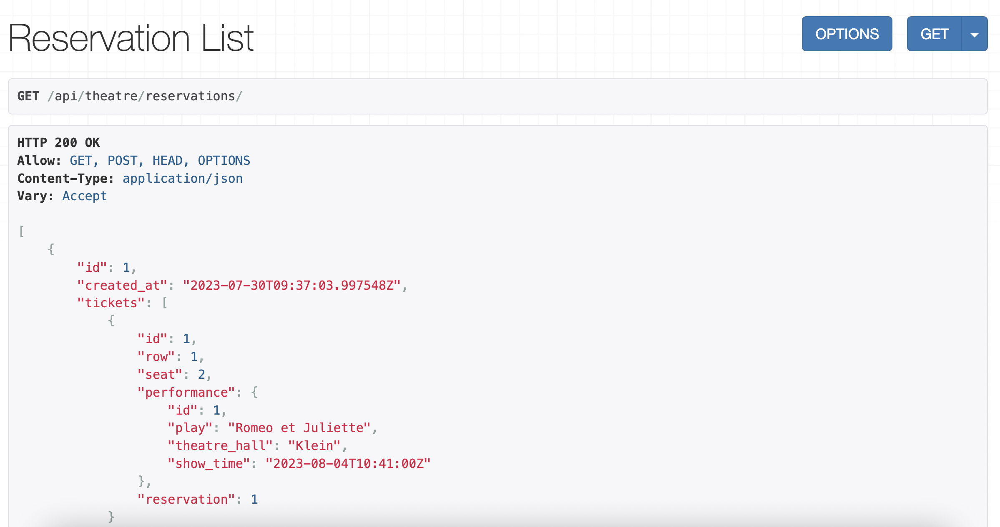

# Theatre Api

## Overview
Theatre Api allows you to track Performances (containing main information about each performance) at your Theatre and sell Tickets to authorized customers.

## Installing / Getting started
```shell
git clone https://github.com/andriy-md/theatre-api.git
cd theatre_service
python3 -m venv venv
source venv/bin/activate
pip install -r requirements.txt
python manage.py runserver      # Starts Django Server
```

## Features
* You cant watch list of all plays with the ability to search Play by its title or genres.
* You may create new Play, assign to it Genre and Actors, as well as update information concerning the existing one or delete it.
* Authorized User may book ticket to specific Performance

## Demo




